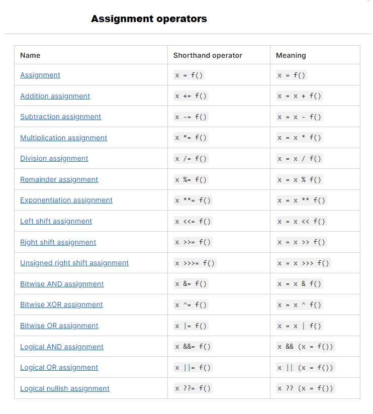
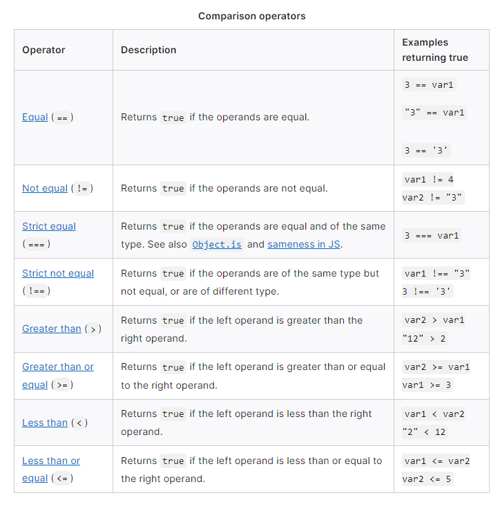

# Class 8: Operators and Loops

---

## What is an assignment operator?

An assignment operator refers to assigning a value to the left operand based on the value of the right operand.

        "operand" is the quantity on which an operation is to be done.

The simple assignment operator is equal ( = ), which assigns the value of its right operand to its left operand. That is, x = f() is an assignment expression that assigns the value of f() to x .

## Assigning to properties

If a variable refers to an object, then the left-hand side of an assignment expression may make assignments to properties of that variable. For example:

        let obj = {};

        obj.x = 3;
        console.log(obj.x); 	// Prints 3.
        console.log(obj); 	// Prints { x: 3 }.

        const key = "y";
        obj[key] = 5;
        console.log(obj[key]); 	// Prints 5.
        console.log(obj); 		// Prints { x: 3, y: 5 }.

## Comparison operators

A comparison operator compares its operands and returns a logical value based on whether the comparison is true. The operands can be numerical, string, logical, or object values. Strings are compared based on standard lexicographical ordering, using Unicode values.

In most cases, if the two operands are not of the same type, JavaScript attempts to convert them to an appropriate type for the comparison. This behavior generally results in comparing the operands numerically. The sole exceptions to type conversion within comparisons involve the === and !== operators, which perform strict equality and inequality comparisons. These operators do not attempt to convert the operands to compatible types before checking equality.

## Loops and iteration

[Click here to view loops on Mozilla](https://developer.mozilla.org/en-US/docs/Web/JavaScript/Guide/Loops_and_iteration)

- Loops offer a quick and easy way to do something repeatedly. 

You can think of a loop as a computerized version of the game where you tell someone to take X steps in one direction, then Y steps in another. For example, the idea "Go five steps to the east" could be expressed this way as a loop:
	
    for (let step = 0; step < 5; step++) {
            // Runs 5 times, with values of step 0 through 4.
    console.log('Walking east one step');
    }

There are many different kinds of loops, but they all essentially do the same thing: 

- they repeat an action some number of times. (Note that it's possible that number could be zero!)

The various loop mechanisms offer different ways to determine the start and end points of the loop. There are various situations that are more easily served by one type of loop over the others.

The statements for loops provided in JavaScript are:

    for statement
    do...while statement
    while statement
    labeled statement
    break statement
    continue statement
    for...in statement
    for...of statement

## “ for ” statement   ***

A “for” loop repeats until a specified condition evaluates to false. 

A “for” statement looks as follows:

        for ([initialExpression]; [conditionExpression]; [incrementExpression])
        statement

When a for loop executes, the following occurs:

1. The initializing expression initialExpression, if any, is executed. This expression usually initializes one or more loop counters, but the syntax allows an expression of any degree of complexity. This expression can also declare variables.

2. The conditionExpression expression is evaluated. If the value of conditionExpression is true, the loop statements execute. Otherwise, the for loop terminates. (If the conditionExpression expression is omitted entirely, the condition is assumed to be true.)

3. The statement executes. To execute multiple statements, use a block statement ({ ... }) to group those statements.

4. If present, the update expression incrementExpression is executed.

5. Control returns to Step 2.

---

## “ while ” statement  ***

A while statement executes its statements as long as a specified condition evaluates to true. 

A while statement looks as follows:

        while (condition)
        statement

If the condition becomes false, statement within the loop stops executing and control passes to the statement following the loop.The condition test occurs before statement in the loop is executed. If the condition returns true, statement is executed and the condition is tested again. If the condition returns false, execution stops, and control is passed to the statement following while.

**To execute multiple statements, use a block statement ({ ... }) to group those statements.**

[Back to Reading Notes](https://tomgtaylor.github.io/reading-notes)
